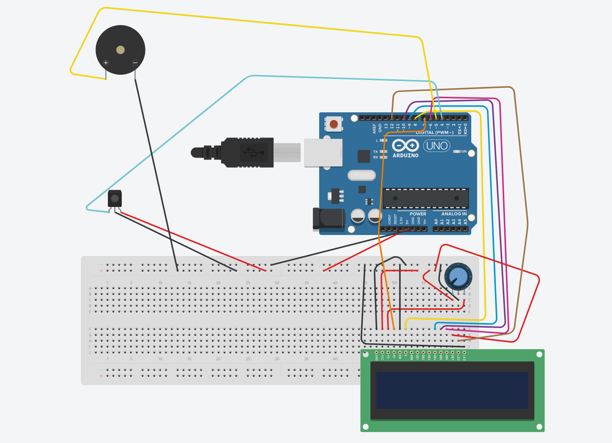

# ArduinoAlarm
An alarm clock I built using an arduio uno, tiny rtc, speaker, ir sensor and an ir remote.

## Circuit

**NOTE:** Due to limitations the circuit maker I used the following modifications have to be made:

- Replace the **buzzer**:
  1. Get an AUX cable and cut one of it's ends.
  1. One of the cables (ussualy the thinner, looking like a third wheel, one) connect it to ground.
  1. From the other 2, one goes to ground and one into the buzzer pin (5).
  1. Connect the uncut end of the cable to whatever free speaker you have.
- Add a TinyRTC module:
  1. Connect the ground pin to ground and the power pin to power.
  1. Connect the SDL and SCL pins to the ones on the arduino.
  1. Instert a CR32 battery in the module
 
**Additional REQs:**

- Generic Remote for IR.

## Remote Buttons

- Volume buttons change the hour with +- 10 minutes.
- Forwards and Backwards buttons change the hour with +- 1 hour.
- Arrow up and down change the hour with +- 1 minute.
- Power button closes the alarm (if running).
